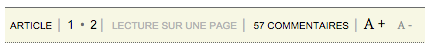

Mediapart Full Page
===================

Current version: **1.0.0**.

DESCRIPTION
-----------

This script works as a browser extension to automatically load the full page version of an article on [Mediapart](www.mediapart.fr/).

INSTALL - GOOGLE CHROME
-----------------------

* Download the [mediapart-full-page.user.js](../../raw/master/mediapart-full-page.user.js) file on your computer.

* Open Google Chrome browser and go to the extension page at: __chrome://extensions__

* Simply drag and drop the ``mediapart-full-page.user.js`` file on this page.

**Note**: To upgrade to a newer version, you need to redo those steps.

INSTALL - FIREFOX & OTHER
-------------------------

* Install the [Greasemonkey](https://addons.mozilla.org/en-US/firefox/addon/greasemonkey/) addon that will manage the script

* Go to [mediapart-full-page.user.js](../../raw/master/mediapart-full-page.user.js): Greasemonkey should open a dialog window to allow the script installation. Click *Install* and you're all set!

USAGE
-----

When accessing an article on Mediapart website, the script will reload the page as a one page version.

FAQ
---

**Why should I use this script?**

If you are like me, and always read the complete article on Mediapart...
